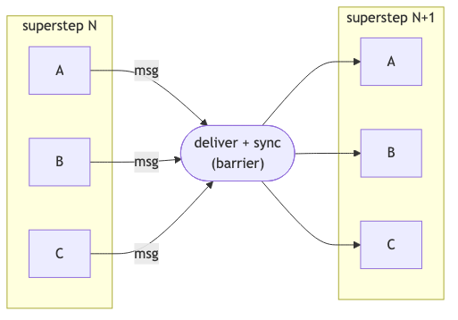
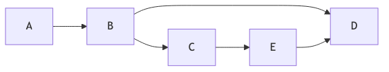
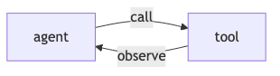
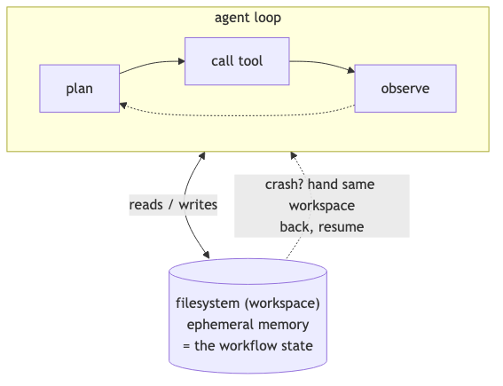
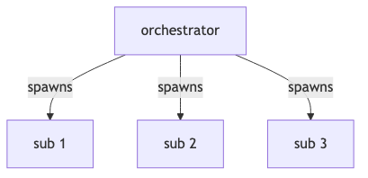
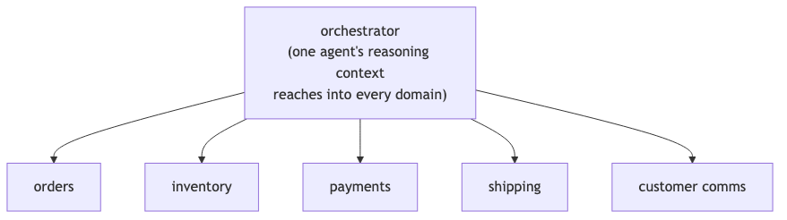
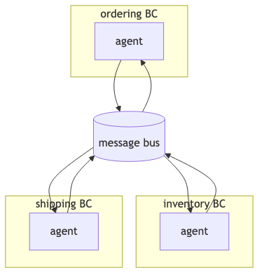

## Table of Contents

- [What graph dataflow actually is](#what-graph-dataflow-actually-is)
- [Where the frontier labs sit](#where-the-frontier-labs-sit)
- [The actual spectrum of orchestration](#the-actual-spectrum-of-orchestration)
- [The cost of a new paradigm](#the-cost-of-a-new-paradigm)
- [What models can do for themselves now](#what-models-can-do-for-themselves-now)
- [We've forgotten about bounded contexts](#weve-forgotten-about-bounded-contexts)
- [So what should you reach for?](#so-what-should-you-reach-for)

---

Microsoft Agent Framework hit 1.0 a few weeks ago. Like Google ADK, LangGraph, and CrewAI before it, it ships two things bundled together: an agent runtime, and a workflow engine. The agent part is fine. The workflow engine is the bit that made me stop and squint.

Workflows are a solved problem in software. We've had finite state machines for decades, distributed sagas over message buses since the 2000s, and durable execution engines since Microsoft Orleans, Azure Durable Functions, and Temporal showed up. And yet here we are in 2026, with every major agent framework shipping its own workflow runtime alongside the agent code.

Let me try to map out why I think this matters.

## What graph dataflow actually is

Crack open the source for Microsoft Agent Framework's Workflows package, or look at LangGraph's Pregel module, and you'll find the same thing: a graph engine running on the BSP (Bulk Synchronous Parallel) model, originally formalised by [Google's Pregel paper](https://research.google/pubs/pregel-a-system-for-large-scale-graph-processing/) for large-scale graph processing.



Every executor with a pending message runs concurrently in a superstep. When all of them finish, outgoing messages get delivered along the edges, and the next superstep kicks off. Repeat until nothing is left to process.

If you've worked with Apache Beam, Akka Streams, or Flink, this should feel familiar. It's the same design that powers stream processing systems. Pregel and its descendants exist because, when you have lots of small computations that need to coordinate via typed messages with checkpointing between rounds, BSP gives you a clean execution model with built-in fan-out, fan-in, and synchronisation barriers.

Where this earns its keep is real but narrow:

- Streaming pipelines with backpressure (token-by-token output through a chain of transformers).
- Declarative authoring tools where non-engineers drag nodes around in a UI (n8n, Zapier are basically this).
- Fan-out-heavy work with typed joins (send the same query to ten agents, aggregate the results).

For the typical agent application, you don't need any of that.

Graph dataflow assumes a topology like this, with fan-out, joins, and supersteps:



Most agent apps actually look like this. An agent loop with tool calls, plus the occasional handoff:



That's a function call inside a `while` loop. You don't need supersteps for it.

## Where the frontier labs sit

Unsurprisingly, Anthropic and OpenAI, the two model labs whose products everyone is integrating with, have very deliberately *not* shipped workflow engines.

|                       | Anthropic / OpenAI                        | Microsoft / Google / LangChain                |
| --------------------- | ----------------------------------------- | --------------------------------------------- |
| Workflow engine       | Don't ship one                            | Ship one bundled with the agent runtime       |
| Composition           | Bring your own (Temporal, FSM, bus, code) | Use ours (graph DSL, declarative YAML)        |
| Examples              | Claude Agent SDK, OpenAI Agents SDK       | MAF Workflows, Google ADK, LangGraph, CrewAI  |
| Bet                   | Models need less scaffolding over time    | Enterprises need built-in compliance + audit  |

Anthropic's ["Building Effective Agents"](https://www.anthropic.com/research/building-effective-agents) essay from late 2024 is unusually pointed. They draw a line between *workflows* (predefined code paths) and *agents* (systems that direct their own behaviour), then explicitly warn against reaching for frameworks. The argument is that frameworks add layers of abstraction that obscure the underlying prompts and responses, and make it tempting to add complexity when a simpler setup would do. They name LangGraph, Bedrock Agents, Rivet, and Vellum specifically.

The Claude Agent SDK reflects this. It's primitives: an agent loop, tool calling, memory hooks, MCP integration. No workflow graph. No node-and-edge DSL. If you want multi-step logic, you write code.

OpenAI's Agents SDK is the same shape. Four primitives: agents, handoffs, guardrails, and sessions. Handoffs aren't a graph topology. They're literally function tools the LLM calls (`transfer_to_refund_agent`). Multi-agent orchestration is just one agent invoking a tool that hands control to another. When users need durability, the recommended pattern is to wrap the SDK inside Temporal: each agent invocation becomes a Temporal activity, and the workflow engine handles persistence and recovery.

So the model labs themselves are saying: ship great primitives, and let people compose them with the orchestration tools they already have.

## The actual spectrum of orchestration

"Workflow" gets used as a single word for at least four different problems. They are not interchangeable.

| Category               | What it solves                             | Example libraries (.NET-leaning)     | Production-grade since |
| ---------------------- | ------------------------------------------ | ------------------------------------ | ---------------------- |
| **In-process FSM**     | Valid state transitions, single process    | Stateless, Automatonymous            | ~2010                  |
| **Distributed saga**   | Cross-service coordination + compensations | MassTransit, NServiceBus, Brighter   | ~2009                  |
| **Durable execution**  | Replay-based recovery through crashes      | Temporal, DurableTask, DBOS, Restate | ~2017                  |
| **Graph dataflow**     | Typed parallel message-passing + streaming | LangGraph, MAF Workflows, Beam       | ~2024 (for agents)     |

The category that doesn't get enough airtime in agent-framework discussions, and is honestly the most important one, is **durable execution**. It gives you something neither an FSM nor a bus can: deterministic replay.

```
   Run 1 (crashes after step 3):                  Run 2 (replay):
   ─────────────────────────────                  ───────────────

   step 1 ──► [LLM call: $0.50]   ✓ logged        step 1 ──► [logged]     skip ✓
   step 2 ──► [tool call]         ✓ logged        step 2 ──► [logged]     skip ✓
   step 3 ──► [LLM call: $5.00]   ✓ logged        step 3 ──► [logged]     skip ✓
   step 4 ──► [tool call]         ✗ CRASH         step 4 ──► [tool call]  runs ▶
                                                  step 5 ──► continues normally
```

The way it works: your code runs, and the engine logs every external call as an event. If your process dies halfway through, it doesn't restart from a saved saga state. It replays your code from the top, skipping calls whose results are already in the log, until it catches up to the live state. From your perspective, you write straight-line async code. From the system's perspective, every step is recoverable.

For long-running agent work (an LLM call that takes thirty seconds, then a tool call that takes two minutes, then another LLM call), this is exactly the right primitive. You really don't want to redo a five-dollar LLM call because your container restarted.

The interesting thing is that **Microsoft already ships DurableTask**, and has done since 2017. The Agent Framework's Workflows package even has a DurableTask integration. Which raises a fair question: if I want durability, I can use DurableTask directly. If I want messaging, I can use MassTransit directly. If I want state validation, I can use Stateless directly. What does the graph runtime add that I couldn't get by composing what already exists?

The honest answer: streaming, and graph-topology authoring. For most agent applications, neither matters.

## The cost of a new paradigm

There's a real cost to learning a new orchestration model, and framework marketing tends to undersell it.

| Adopting a graph dataflow runtime           | Composing existing primitives                  |
| ------------------------------------------- | ---------------------------------------------- |
| Executor lifecycle                          | `async Task` (already known)                   |
| Edge types: direct, fan-in, fan-out, switch | Stateless config (afternoon to learn)          |
| Superstep concurrency rules                 | MassTransit sagas (well-documented)            |
| Port system + checkpointing                 | DurableTask (years of Azure Functions docs)    |
| All framework-specific                      | Composes; transfers everywhere                 |

The framework pitch is "we'll handle the orchestration concerns for you." The reality, often, is that you've added a layer of indirection between your code and the things actually running. Debugging a misbehaving agent flow now means understanding *both* the model's reasoning *and* the runtime's superstep scheduling. When something hangs: is it the LLM, or the edge router?

This is where Anthropic's framework critique lands hardest. They didn't say frameworks are wrong. They said frameworks obscure the prompts and responses. For agent work specifically, that obscurity is expensive. The single most useful debugging move is reading what the model was actually asked, and what it actually said. Anything that puts a layer between you and that loop costs you when things go sideways.

There is a fair counterargument. Declarative graph workflows make compliance, audit, and visualisation easier. If you're an enterprise selling to regulated industries, "here is the YAML that defines exactly what the agent does" is genuinely valuable, and that's clearly the bet Microsoft and Google are making. I'm not saying that bet is wrong. It's just a different bet from "ship great primitives and trust developers to compose them," which is what the model labs themselves are doing.

## What models can do for themselves now

The other reason I'm sceptical of heavy workflow engines for agents is that the models are getting better at running their own long-horizon work without external orchestration scaffolding.



Anthropic's [recent posts on context engineering](https://www.anthropic.com/engineering/effective-context-engineering-for-ai-agents) describe Claude Code's pattern: a long-running agent that uses primitives like `glob` and `grep` to navigate its environment just-in-time, with `CLAUDE.md` files providing high-level instructions and the filesystem itself as scratch memory. It's not a graph. It's not a state machine. It's a model with good tools and a workspace.

The pattern that's emerging, and I think this is the actually interesting trend, is using the filesystem as ephemeral memory for long-running tasks. The agent reads, writes, and updates files as it works. If it crashes, you can resume by handing it back the same workspace and asking it to continue. The "state" of the workflow is the state of the files, which is exactly the abstraction every developer already understands.

This is roughly how Claude Code, Cursor, and similar coding agents work today. The orchestration is light because the model is doing the orchestration. The framework's job is to give the model good tools, a sandbox to run them in, and a way to recover when something fails. The job is *not* to model the agent's reasoning as a graph.

If models keep improving at long-horizon coherence (and the trajectory over the last eighteen months says they will), then the heavy orchestration frameworks built for 2024-era agent capabilities will start to feel like overkill, the same way XML-based BPM engines feel like overkill for most modern web apps.

## We've forgotten about bounded contexts

Step back from the framework debate and look at what people are actually building.

The most common multi-agent architecture in practice (the one Claude Agent SDK encourages, the one [Anthropic's research agent uses](https://www.anthropic.com/engineering/multi-agent-research-system), the one most production deployments converge on) is orchestrator + subagents:



The orchestrator decides what work needs doing, spawns subagents to do it, possibly spawns more, and aggregates the results. This is fine for a single coherent task. Where it goes wrong is when teams scale this pattern across multiple business domains, and end up with one orchestrator whose subagents can touch the entire system: orders, inventory, payments, shipping, customer comms, the lot.

That's a monolithic agentic system. We're building 2010-era enterprise monoliths and calling them agents.

**The anti-pattern.** One agent reaches everywhere — its reasoning context spans orders, inventory, payments, shipping, and customer comms.



**The architecture.** Agents per bounded context, talking via messages.



[Domain-driven design](https://martinfowler.com/bliki/BoundedContext.html) solved this fifteen years ago. A bounded context owns its model, its language, its rules, its data. If something inside one context needs to cause an effect in another, you don't reach across. You send a message. The receiving context decides how to interpret it. This is the basic shape of every microservices architecture that actually scales.

Agents should follow the same rule. An ordering agent operates on orders. It does not directly modify inventory, charge cards, or trigger shipments. When an order needs to reserve stock, it publishes `OrderPlaced` (or sends `ReserveInventory`), and the inventory context's agent picks it up and does the work inside its own boundary.

This isn't just architectural hygiene. Bounded contexts give you everything you'd want from a serious agent system:

- **Blast radius.** A misbehaving inventory agent can corrupt inventory. It can't burn down ordering and shipping with it.
- **Authority boundaries.** Each agent has tools and permissions only for its own context. Least-privilege becomes enforceable instead of aspirational.
- **Independent evolution.** Teams can change the inventory agent's prompts, model, or tools without coordinating with five other domains.
- **Auditability.** "What did the agent do?" has a finite answer per BC, not a distributed trace through one mega-orchestrator's reasoning.

And critically, this is how you get back to mature orchestration tooling. Cross-BC messages are exactly what message buses are for. MassTransit, NServiceBus, Kafka, RabbitMQ, all designed for this. If your agent architecture is bounded contexts communicating via events, you don't need a graph workflow engine to coordinate them. You need a bus.

The bundled-workflow-engine approach actively works against this. It encourages you to put all your agents in one workflow graph, in one process, sharing one execution context. That's the topology of a monolith. Labelling the boxes "agent" instead of "service" doesn't change it.

If you're building anything beyond a toy demo, the question isn't "what graph runtime should orchestrate my agents." It's "what are my bounded contexts, and which agents live in each one?"

## So what should you reach for?

| If you need...                                        | Reach for                                                              |
| ----------------------------------------------------- | ---------------------------------------------------------------------- |
| In-process state validation                           | **Stateless** (or equivalent FSM)                                      |
| Cross-service coordination with compensations         | **MassTransit + Automatonymous**, NServiceBus                          |
| Long-running tasks that survive process restarts      | **DurableTask** or **Temporal**                                        |
| Agent loops                                           | **Claude Agent SDK** or **OpenAI Agents SDK**, composed with the above |
| Fan-out-heavy streaming pipelines                     | A graph runtime (LangGraph, MAF Workflows)                             |
| "Agent application" by default                        | SDK + filesystem + the right one of the above                          |

The thing I want to push back on is the assumption that "agent application" implies "agent framework with bundled workflow engine." It doesn't. Most agent applications I've seen would be better served by an SDK plus one of the existing orchestration tools above, picked deliberately based on what the application actually needs.

Workflows are a solved problem. Let's not unsolve them in the name of progress.

---

## References

- Malewicz, G., Austern, M.H., Bik, A.J.C., Dehnert, J.C., Horn, I., Leiser, N., and Czajkowski, G. ["Pregel: A System for Large-Scale Graph Processing."](https://research.google/pubs/pregel-a-system-for-large-scale-graph-processing/) Proceedings of the 2010 ACM SIGMOD International Conference on Management of Data, 2010.
- Anthropic. ["Building Effective Agents."](https://www.anthropic.com/research/building-effective-agents) Anthropic Research, 19 December 2024.
- Anthropic. ["How we built our multi-agent research system."](https://www.anthropic.com/engineering/multi-agent-research-system) Anthropic Engineering, June 2025.
- Anthropic. ["Effective context engineering for AI agents."](https://www.anthropic.com/engineering/effective-context-engineering-for-ai-agents) Anthropic Engineering, 2025.
- Fowler, Martin. ["BoundedContext."](https://martinfowler.com/bliki/BoundedContext.html) martinfowler.com, 2014. (Originating concept: Evans, Eric. *Domain-Driven Design: Tackling Complexity in the Heart of Software*. Addison-Wesley, 2003.)

