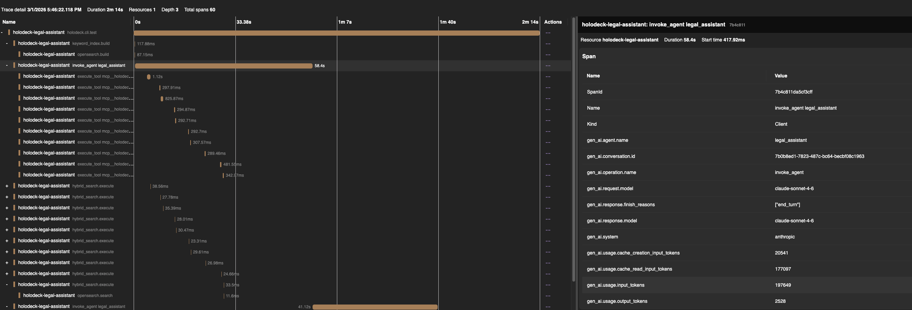
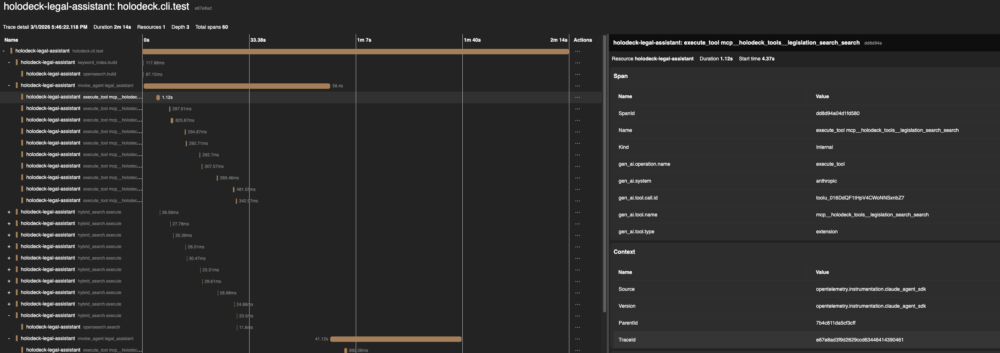

## Table of Contents

- [Background](#background)
- [The problem](#the-problem)
- [What I built](#what-i-built)
- [The hooks thing](#the-hooks-thing)
- [Getting started](#getting-started)
- [What the traces look like](#what-the-traces-look-like)
- [Rough edges and what's next](#rough-edges-and-whats-next)

---

## Background

A while back I wrote about [going all-in on Claude Agent SDK for Holodeck](https://justinbarias.io/blog/you-dont-need-another-agent-framework/). The short version: I decoupled Holodeck from Semantic Kernel through an abstraction layer, then hooked up Claude Agent SDK as a first-class backend — bash, filesystem, MCP tools, sandboxing, all native.

That post was about *running* agents. This one is about *seeing what they're doing once they run*.

With Semantic Kernel, this was a solved problem — it has native OpenTelemetry integration, so you got traces and metrics for free just by wiring up a provider. When I moved to Claude Agent SDK, that didn't exist. So I had to build it myself.

## The problem

I started running longer agent sessions — multi-turn research tasks, code generation workflows, that kind of thing. And pretty quickly I realized I had no idea what was happening inside them.

Like, basic stuff:
- How many tokens did a 10-turn conversation actually use?
- Which tool calls are taking forever?
- Did the agent error out on turn 5 and just keep going?

I could grep through logs, sure. But I wanted real traces — the kind where you open Jaeger or Grafana and see a waterfall of what happened, with timing, with parent-child relationships between agent turns and tool calls.

OpenTelemetry already has [GenAI semantic conventions](https://opentelemetry.io/docs/specs/semconv/gen-ai/) for exactly this. Nobody had built an instrumentor for the Claude Agent SDK yet. So I did.

## What I built

[`opentelemetry-instrumentation-claude-agent-sdk`](https://github.com/justinbarias/opentelemetry-instrumentation-claude-agent-sdk) — it's a Python package that monkey-patches `query()` and `ClaudeSDKClient` at runtime. Standard OTel instrumentor pattern, nothing fancy.

After you call `.instrument()`, every agent invocation gets:

- An `invoke_agent` span with model, token counts (input, output, cache hits), finish reason, conversation ID
- `execute_tool` child spans for each tool call — Bash, Read, Write, MCP tools, whatever
- Histograms for token usage and operation duration

It follows the GenAI semconv spec, so these traces look like any other LLM provider in your existing dashboards. That was important to me — I didn't want to invent custom attributes that only work with Claude.

It only depends on `opentelemetry-api` and `wrapt` at runtime (not the SDK), so if you don't configure a `TracerProvider`, it's literally zero overhead — the OTel no-op path handles it.

Here's what `.instrument()` actually does under the hood:

```
┌─────────────────────────────────────────┐
│ ClaudeAgentSdkInstrumentor.instrument() │
└─────────────────────────────────────────┘
                         │
                         ▼
  Monkey-patches 4 SDK methods via wrapt:

  ┌─────────────────────┐
  │ wrapt.wrap  query() │
  │   -> _wrap_query    │
  └─────────────────────┘

  ┌────────────────────────────────────────┐
  │ wrapt.wrap  ClaudeSDKClient.__init__() │
  │   -> _wrap_client_init                 │
  └────────────────────────────────────────┘

  ┌─────────────────────────────────────┐
  │ wrapt.wrap  ClaudeSDKClient.query() │
  │   -> _wrap_client_query             │
  └─────────────────────────────────────┘

  ┌────────────────────────────────────────────────┐
  │ wrapt.wrap  ClaudeSDKClient.receive_response() │
  │   -> _wrap_client_receive_response             │
  └────────────────────────────────────────────────┘

                         │
                         ▼
  At call time, wrappers do:

  ┌─────────────────────────────────┐   ┌──────────────────────────────────┐   ┌────────────────────────────────────────────────────┐
  │ _wrap_query (standalone path)   │   │ _wrap_client_init                │   │ _wrap_client_query + _wrap_client_receive_response │
  │                                 │   │                                  │   │                                                    │
  │ 1. inject hooks into options    │   │ 1. call original __init__()      │   │ 1. query(): create span, set context               │
  │ 2. create invoke_agent span     │   │ 2. inject hooks into options     │   │ 2. receive_response(): async iterate               │
  │ 3. set InvocationContext        │   │ 3. store OTel config on instance │   │    - intercept AssistantMessage                    │
  │ 4. async iterate wrapped()      │   │                                  │   │    - intercept ResultMessage                       │
  │    - intercept AssistantMessage │   │                                  │   │ 3. record metrics, end span                        │
  │    - intercept ResultMessage    │   │                                  │   │                                                    │
  │ 5. record metrics, end span     │   │                                  │   │                                                    │
  └─────────────────────────────────┘   └──────────────────────────────────┘   └────────────────────────────────────────────────────┘

  │
  ▼
  All paths inject hooks into options:

  ┌───────────────────────────────────────────┐
  │ Injected Hooks (via merge_hooks)          │
  │                                           │
  │ PreToolUse     -> open execute_tool span  │
  │ PostToolUse    -> close span (success)    │
  │ PostToolUseFail-> close span (error)      │
  │ SubagentStart  -> (future: subagent span) │
  │ SubagentStop   -> (future: close span)    │
  └───────────────────────────────────────────┘
```

## The hooks thing

This is the part I'm actually proud of.

The Claude Agent SDK has a hook system — `PreToolUse`, `PostToolUse`, `PostToolUseFailure`, etc. Most people probably ignore them. But they're perfect for instrumentation.

The naive approach would be to parse tool calls out of the response stream after they finish. That works, but you lose accurate timing, and you can't catch failures cleanly.

Instead, I register hook callbacks. When a tool starts, `PreToolUse` fires and I open a span. When it finishes, `PostToolUse` closes it. If it crashes, `PostToolUseFailure` closes it with an error. Simple.

```
PreToolUse("Bash", tool_use_id="xyz")   -> span starts
  ... tool runs ...
PostToolUse("Bash", tool_use_id="xyz")  -> span ends
```

The tool_use_id lets me correlate start and end events even when multiple tools run. And the hooks are merged *after* any hooks you've already set up, so the instrumentation stays out of your way.

You can also opt into capturing tool arguments and results with `capture_content=True`. It's off by default because you probably don't want prompt contents showing up in your trace backend.

## Getting started

```bash
pip install opentelemetry-instrumentation-claude-agent-sdk[instruments]
```

Minimal setup:

```python
from opentelemetry.sdk.trace import TracerProvider
from opentelemetry.sdk.trace.export import SimpleSpanProcessor, ConsoleSpanExporter
from opentelemetry.instrumentation.claude_agent_sdk import ClaudeAgentSdkInstrumentor

provider = TracerProvider()
provider.add_span_processor(SimpleSpanProcessor(ConsoleSpanExporter()))

ClaudeAgentSdkInstrumentor().instrument(tracer_provider=provider)
```

Or if you use `opentelemetry-instrument` for auto-instrumentation, it just picks it up — the instrumentor is registered as an entry point.

```bash
opentelemetry-instrument python my_agent_app.py
```

Two lines if you already have a global TracerProvider:

```python
from opentelemetry.instrumentation.claude_agent_sdk import ClaudeAgentSdkInstrumentor
ClaudeAgentSdkInstrumentor().instrument()
```

## What the traces look like

Here's roughly what a multi-turn session looks like in your trace viewer:

```
invoke_agent                             [3.2s, 1847 in / 423 out tokens]
├── execute_tool "Bash"                  [0.8s]
├── execute_tool "Read"                  [0.1s]
└── execute_tool "mcp__github"           [1.4s, type=extension]

invoke_agent                             [1.1s, 2103 in / 187 out tokens]
└── execute_tool "Write"                 [0.05s]
```

Both `invoke_agent` spans share the same `gen_ai.conversation.id`, so you can track a whole session. MCP tools get tagged as `type=extension`, built-in ones as `type=function` — handy if you want to see how much time your agent spends in external tools vs native ones.

Here's the `invoke_agent` span in the Aspire dashboard — you can see token counts, model, finish reason, and conversation ID all as span attributes:



And drilling into an `execute_tool` child span, you get the tool name, type, and the MCP tool path:



## Rough edges and what's next

This is alpha. It works, I'm using it, but there's stuff I haven't gotten to yet:

- **Subagent tracking** — the hooks are wired for `SubagentStart`/`SubagentStop` but I haven't built the spans yet
- **Content capture on agent spans** — right now `capture_content` only covers tool args/results, not the full prompt/response

It's [MIT-licensed on GitHub](https://github.com/justinbarias/opentelemetry-instrumentation-claude-agent-sdk). If you're running Claude agents and want to actually see what they're doing, try it out. If something's broken, [file an issue](https://github.com/justinbarias/opentelemetry-instrumentation-claude-agent-sdk/issues).

---

*Previously: ["You Don't Need Any Other Agent Framework"](https://justinbarias.io/blog/you-dont-need-another-agent-framework/) — where I talked about decoupling Holodeck from Semantic Kernel and hooking up Claude Agent SDK as a first-class backend.*
